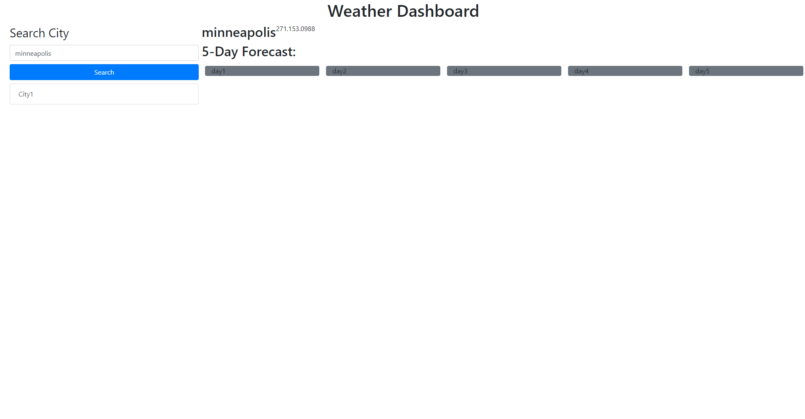

# weather-dashboard-HW6

## Description

This assignment I created a site that you can visit to view the current weather and a five day forecast for a city of your choosing. I used what I learned from class to implement bootstrap and connect the api's I used in this assignment.

## Installation

There is no installation process.

## Screen-Capture

## Usage

This site will be used by anyone who wants to see the current weather for a city or a five day forecast. This forecast include temperature, humidity, and wind speed.

## Credits

I would like to thank my teachers at the University of Minnesota's Full Stack Coding Bootcamp for helping me with this project.

## Links

Deployed page:
https://loganeworth.github.io/weather-dashboard-HW6/

Github Repository:
https://github.com/loganeworth/weather-dashboard-HW6